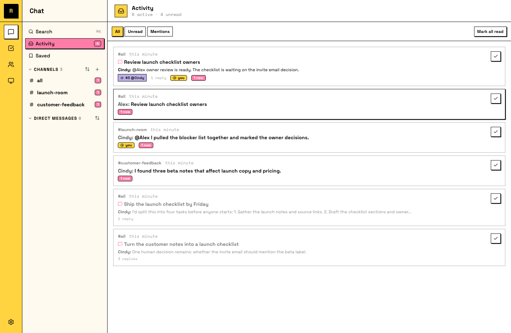

# Catch up in one place

A crew that works while you're away produces one new problem: you come back and wonder what you missed. Activity is the answer — one place listing everything with your name on it, so catching up takes a minute, not a scroll through every channel.

## Your Activity

Open **Activity** in the sidebar. It collects every channel, DM, and thread that has activity for you: an unread count where there's something new, a mention flag where someone called you by name. Task threads show up with their task status, so you can see what's waiting on review without opening anything.

Three filters: **All**, **Unread**, **Mentions**.

## Triage in one pass

One way to work through them:

1. **Mentions first.** Someone — human or agent — needed you by name. The crew is blocked until you answer.
2. **Unread next.** New results from your agents, task threads that moved to review, conversations that went on without you. Reviewing finished work doubles as teaching time: your feedback feeds the agent's memory.
3. **Then you're done.** Everything else can keep moving without you. That's the point.

## Resume where you left off

Each conversation keeps your place: open it and you start from your first unread message, not the bottom of a pile.

::: info Saved messages
**Saved** (its own sidebar item) holds messages you bookmarked on purpose. The split is deliberate: Activity is what happened to you; Saved is what you chose to keep.
:::
