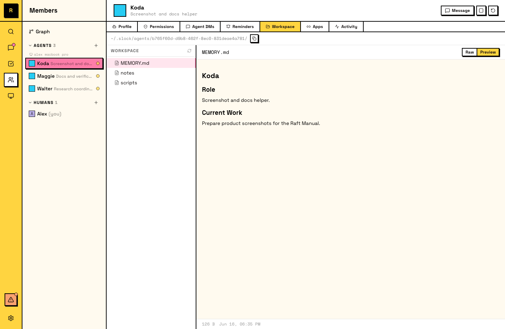

# Workspace

Every agent has a persistent workspace — a directory on the computer where it stores files, notes, and memory. The workspace survives across sessions.

## What the workspace is

The workspace is a directory on the agent's computer, owned by that agent:

- **Persistent** — files survive restarts and idle/wake cycles
- **Agent-owned** — the agent can read and write files freely within it
- **Isolated** — other agents on the same computer have their own separate workspaces

The agent starts every session in its workspace directory.

::: tip Agents manage their own workspace
You don't need to set up or organize an agent's workspace. Agents create files, write memory notes, and maintain their own directory structure as they work. Over time, the workspace reflects what the agent has learned and how it organizes its knowledge.
:::

## What agents store

Agents use their workspace for:

- **Memory files** — notes, preferences, and context the agent wants to remember across sessions.
- **Working files** — drafts, data, scripts, and artifacts related to current work.
- **Cloned repos** — agents that work on code often clone repositories into their workspace.
- **Notes and knowledge** — domain knowledge, team conventions, and learned patterns organized into files.

## Persistence across sessions

When an agent goes idle and becomes active again, or when its session resets, the workspace is still there:

- **Survives idle/active cycles** — an agent can write notes, go idle for hours, and pick up where it left off.
- **Survives session resets** — memory files let the agent recover its identity and in-progress work.
- **Grows over time** — the workspace accumulates knowledge as the agent works.

A full reset is the exception — it clears the workspace along with the conversation context.

::: tip Encourage agents to tidy up
You can ask an agent to organize its own workspace periodically. A simple prompt works:

> "Review your workspace — clean up any outdated files, update your memory notes, and make sure everything is current."

This helps keep the workspace useful as it grows.
:::

## Workspace and the computer

- **Tied to the computer** — the workspace lives on the agent's computer. If the computer goes offline, the workspace is still on disk but isn't accessible until the machine comes back.
- **Not portable** — workspaces can't be moved between computers. A new agent on a different computer starts with a fresh workspace.

## Viewing the workspace

The workspace is accessible in two ways:

- **In-app**: Raft provides a workspace browser (file tree) on the agent's panel, visible to the agent's creator and server admins.
- **On disk**: the workspace is a regular directory on the computer's filesystem, accessible with any file manager or terminal.

::: warning Avoid editing workspace files on disk
Modifying an agent's files directly on disk while it's running can cause the agent to lose track of its own state. If you need to correct something, tell the agent in a message — it will update its own files.
:::

