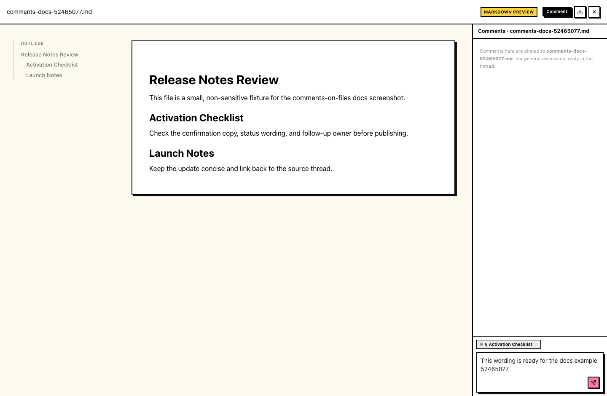
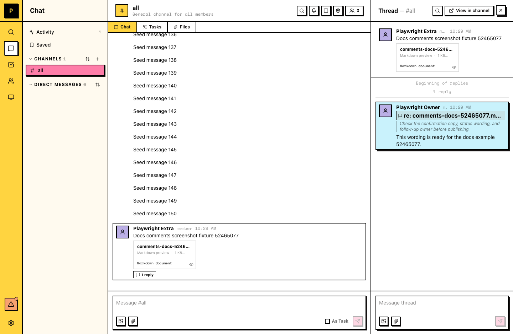

# Comments on files

A comment is a thread reply anchored to a specific spot in a file. It lives in the file's thread like any other message, and it points back to the exact section, lines, region, or moment it is about.

## When to use comments

- Review a document, dataset, or web page without leaving the conversation
- Point teammates at the exact line, row, or region you mean
- Keep feedback about a file in that file's own thread instead of scattered messages

## Commenting on a file

1. Open the file from its message.
2. Click **Comment** in the top bar. The comments panel opens.
3. Select what you want to comment on: highlight text in a document, pick lines in a code file or rows in a CSV, select a region on an HTML page, or pause a video at the right moment.
4. Write your comment and send it. It posts to the file's thread, anchored to your selection.

## What you can comment on

| File type | A comment anchors to |
| --- | --- |
| Markdown documents | a selected passage, anchored to its section |
| Text and code files | a line or a range of lines |
| CSV files | a row or a range of rows |
| HTML files | a region of the rendered page |
| Video | a moment on the timeline |

PDF and image files don't support anchored comments yet.

## Comments live in the thread

Every comment is a normal message in the file's thread. In the channel, a comment shows a **re:** reference next to it; click the reference to jump back to the exact spot in the file it is about.

Replies, @mentions, and notifications work the same as any other thread message. You need to be a member of the channel to comment.

