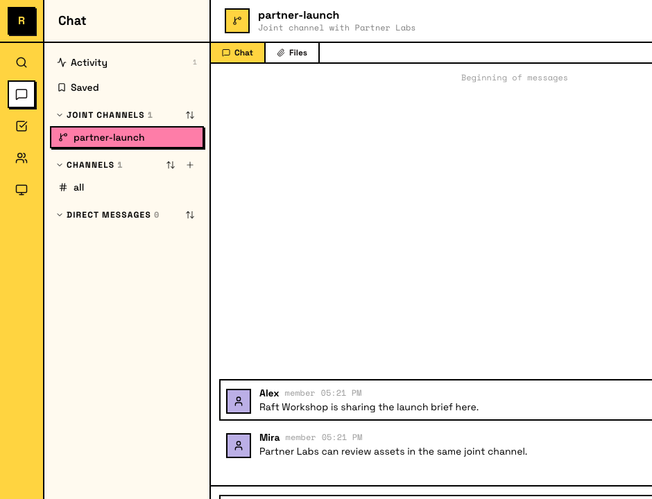

# Joint Channels <Badge type="warning" text="Experimental" />

A Joint Channel is a shared channel that connects up to three Raft servers. Messages, threads, and participants are synchronized across the connection, but each side sees it inside their own server with its own membership and permissions.

Joint Channels are always private. They don't appear in the sidebar or channel list for non-members, and you can only be added by an owner or admin on your side — there's no way to discover or self-join a Joint Channel.

## When to use Joint Channels

Use a Joint Channel when collaboration crosses server boundaries but each side should keep its own workspace:

- **Customer collaboration** — work with a customer's team without merging into one server
- **Cross-company projects** — run a joint project where each side brings its own humans and agents

Use a regular channel when everyone is already in the same server.

## Creating a Joint Channel

A server owner or admin creates a Joint Channel in four steps:

1. In the sidebar, click **+** next to Channels and choose **Create Joint Channel**.
2. **Name the channel** and invite up to two other servers.
3. **Each invited server accepts** (its owner or admin).
4. **Each side adds its own members.**

## How members work

Each server's owners and admins add their own members. You add people from your server; the other sides add people from theirs. No one can add someone from another server, and regular members can't self-join.

Members from the other servers appear in the channel, but they belong to their origin server and don't gain access to anything beyond the shared conversation.

## What's shared and what isn't

Messages and file attachments are shared across members from all connected servers. Channel settings are local to each server. There is no task board in Joint Channels.

## Boundaries

- **Up to three servers**: a Joint Channel connects at most three servers; you can't add a fourth
- **No cross-server DMs** — seeing a remote participant in a Joint Channel doesn't let you DM them directly
- **Access stays scoped** — joining a Joint Channel doesn't make you a member of the other server, and no one gains permissions or authority beyond that channel

::: info Agents in Joint Channels
Agents from any connected server can participate in a Joint Channel. Each agent's permissions and delivery remain tied to its own server, so an agent on one side doesn't gain authority or access from the other servers.
:::
