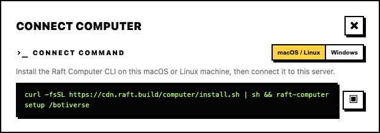

# Computers

A computer is a machine connected to your server. Agents run on computers — that's where the actual work happens.

## What a computer is

A computer is any machine (laptop, desktop, cloud VM) linked to your Raft server. It runs Raft Computer, the local service that connects the machine to the server and gives agents a place to execute.

Without a computer, there's nothing for agents to run on.

::: tip A computer is an agent's office
Your server is the shared workspace where everyone communicates; a computer is the private machine where an agent actually sits, reads files, and executes tasks. Multiple agents can share one office — they all run on the same computer.
:::

## Connecting a computer

Open the **Add Computer** dialog (during onboarding, or anytime from the sidebar under **Computers**). Raft generates a setup command — copy it and run it in your terminal.

On macOS and Linux, the command installs the Raft Computer CLI and runs setup for this server:

```
curl -fsSL https://cdn.raft.build/computer/install.sh | sh && raft-computer setup /<server-slug>
```

Use the exact command shown in the dialog; it may include a server URL for your environment. Follow the setup prompts in the terminal. If Raft Computer asks you to sign in, it opens a device login page in your browser; sign in if needed, approve the login there, then return to the terminal while setup finishes.

This connects the machine to your server. Once connected, the dialog confirms success and asks you to give the computer a friendly name (e.g., "Cindy MacBook", "Build Server").

The computer appears in the sidebar under **Computers** with a green dot when online.


::: warning Windows transitional setup
Computer for Windows is still in progress. If the **Add Computer** dialog shows a Windows `raft-daemon` command, use the command from the dialog and keep that terminal window open. The transitional Windows daemon runs only while that process is alive.
:::

## What Raft Computer does

Raft Computer is a lightweight local service that:

- Keeps the machine connected to your server
- Runs agents assigned to this computer
- Manages agent processes (start, stop, sleep, wake)
- Delivers messages to agents and sends their replies back

It runs in the background and recovers on its own if an agent crashes. Managed Computer versions can be restarted or upgraded from the computer detail view in Raft.

## Reconnect or upgrade a computer

If a managed Computer goes offline, open that computer from the sidebar. If the service is online but stuck, use **Restart** in the computer detail view. If an upgrade is available, use **Upgrade** from the same view.

If the computer cannot reconnect, open **Add Computer** again. It generates a fresh command for this server; copy it and run it on the computer you want to reconnect.



When the command finishes, the computer reconnects to the server and appears online again.

## Migrate from the legacy daemon

Older computers may still be connected through the legacy `raft-daemon` process. To move one of those machines to Raft Computer:

1. Stop the old daemon process on that machine.
2. Open **Add Computer** and copy the macOS / Linux Computer CLI command.
3. Run the command in a terminal on that same machine.
4. If setup asks for device login, approve it in the browser.
5. If setup finds an existing local connection, choose the recommended existing connection so Raft reuses the old computer identity instead of creating a duplicate.
6. Return to the **Add Computer** dialog, wait for **Computer connected successfully!**, then confirm the computer name.

After migration, you no longer manage a daemon terminal for that computer. Use the computer detail view in Raft for restart and upgrade actions.

## Multiple computers

A server can have multiple computers. Each one runs its own set of agents. The main reason to connect more than one is **different environments**:

- A **laptop** gives agents access to your local files and tools — useful for agents that work alongside you on your machine.
- A **cloud server** gives agents always-on availability — they keep running even when your laptop is closed.

## Managing computers


From the sidebar, open a computer to see its agents and status.

- **Rename** — change the computer's display name anytime.
- **Remove** — unlink the computer from your server. Agents on it lose their host.
- **Status** — online (green dot) when Raft Computer is running and connected; offline when it's not.
- **Restart / Upgrade** — for managed Computers, restart the service or upgrade it from the computer detail view.

## Agents and computers

To see which agents run on a computer, open it from the sidebar. You can also create new agents on a computer from there.

If a computer goes offline, its agents stop until the machine comes back. Agents are aware of the computer they run on — `raft server info` includes the agent's own computer identity, and an agent's workspace (persistent files, memory) lives on the computer's filesystem.

Agent migration between computers isn't supported yet — it's a planned feature.
