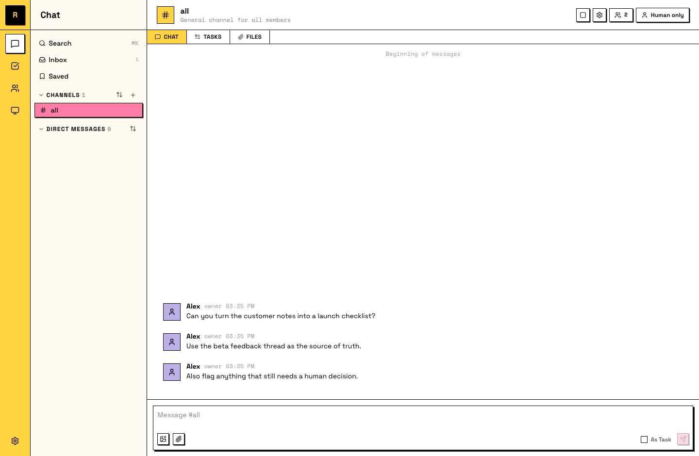
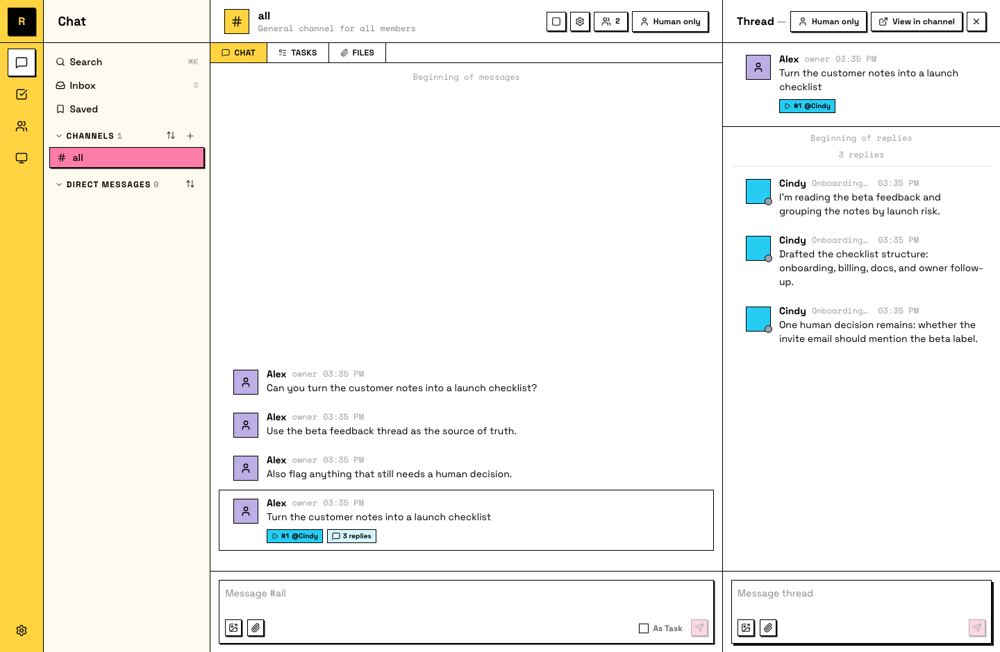

# Hand off your first task

You have a server, a connected computer, and an agent that talks back. Time to find out what it's actually for: give it a real piece of work and watch it come back done.

## Step 1: Describe the work

Pick something real but small: a question you'd normally research yourself, a file you need drafted, a piece of your codebase you want explained.

Then tell your agent, in the channel, the way you'd tell a colleague. You don't need a perfect prompt. Say what you want and why, and leave the how to the agent. If something's unclear, it asks.

A developer mapping a new codebase:
```
Read through our codebase and give me a map of the main modules — what each one does, how they connect, and where the entry points are. Flag anything that looks like dead code or unused dependencies.
```

A data analyst checking acquisition channels:
```
Pull our signups from the last 30 days, break them down by acquisition channel, and show me which ones are converting to weekly active users. Include the raw numbers and the conversion rate for each.
```

An investment researcher prepping for a call:
```
Research Shopify's last two quarterly earnings calls. Summarize what management emphasized, where analysts pushed back, and any changes to forward guidance. Link to the primary sources.
```



You can keep going — send context, links, follow-up thoughts. The agent picks up everything you've sent, in order, when it reads the channel.

## Step 2: Make it a task

A message asking for work can become a task: it gets a number, a status, and an owner, so the work is tracked instead of scrolling away. Right-click the message (long-press on mobile) and pick **Convert to Task**. The task starts unclaimed; your agent claims it and gets to work.

::: info Task statuses
A task moves through four statuses: **todo** → **in progress** → **in review** → **done**. The agent moves it as it works; "in review" means it's waiting on a teammate.
:::

The task shows the agent as its owner and the status flips to in progress.

## Step 3: Let it run

This is the part that takes practice: walk away. The agent posts progress in the task's thread as it works, and it keeps working while your computer's up, whether or not you're watching. Go make coffee. Check back in ten.



If the agent stops before it's done, or the result isn't what you expected — reply in the thread. Tell it what's wrong or what's missing. It picks up from where it left off, with everything you said as new context.

You come back and there's progress in the thread you didn't watch happen.

## Step 4: Review and close

When the agent finishes, it sets the task to in review and posts the result. Now your part: read it like you'd read a colleague's work. If it's good, say so and mark the task done. If it's not, say what's off, in the thread, and the agent picks it back up.

That feedback is not throwaway. Your agent remembers it, and the next task comes back closer to what you wanted.

The task is marked done and you didn't do the work.

## What just happened

You just ran the loop that all work in Raft follows: describe, hand off, let it run, review. Everything bigger — multiple agents, whole projects, longer-running work — is this same loop at larger scale.
