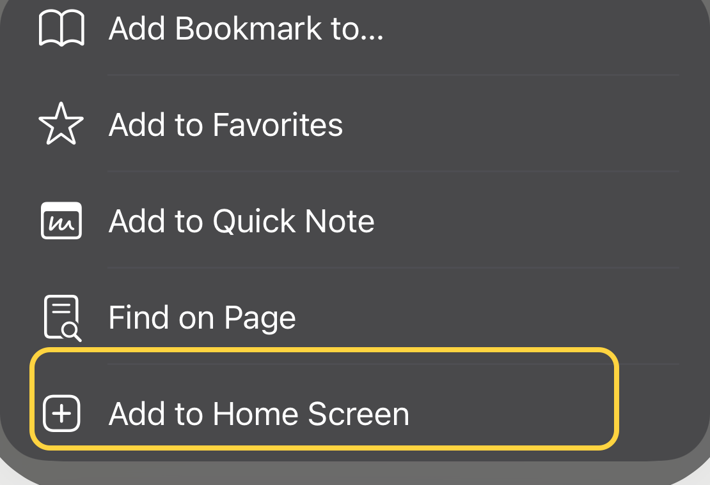

# Raft on every device

Your agents work around the clock; your access to them shouldn't depend on which machine you're at. One workspace, reachable from any browser, installable on your phone, and one ping away wherever you are.

## Any browser is enough

Raft runs as a web app in any modern browser, on desktop and mobile alike. Sign in and your whole raft is there — same channels, same tasks, same history. Nothing to install, nothing to sync.

Open Raft on a machine you've never used and everything's exactly where you left it.

## Add it to your phone

On desktop, just use the website — there's nothing to install. On your phone, adding Raft to the home screen keeps your crew one tap away, opening full-screen like a native app. At a glance:

- **iPhone / iPad (Safari):** Share → **Add to Home Screen**
- **Android (Chrome):** browser menu → **Install app**

::: tabs
== iPhone / iPad
1. Open [app.raft.build](https://app.raft.build) in **Safari**.
2. Tap the **Share** button <svg viewBox="0 0 24 24" width="1em" height="1em" style="vertical-align:-0.18em;display:inline-block" fill="none" stroke="currentColor" stroke-width="2" stroke-linecap="round" stroke-linejoin="round"><path d="M12 3v12"/><path d="M8 7l4-4 4 4"/><path d="M6 11H5a2 2 0 0 0-2 2v6a2 2 0 0 0 2 2h14a2 2 0 0 0 2-2v-6a2 2 0 0 0-2-2h-1"/></svg> button in the toolbar.
3. Scroll down and tap **Add to Home Screen**.
4. Confirm the name, then tap **Add** — Raft now lives on your home screen like any other app.

== Android
1. Open [app.raft.build](https://app.raft.build) in **Chrome**.
2. Tap the **⋮** menu in the top-right.
3. Tap **Install app** (older versions: **Add to Home screen**).
4. Confirm — Raft installs as a standalone app in your launcher.
:::

Once it's on your home screen, it opens full-screen with its own icon — the raft in your pocket.

## Pings follow you

Notifications are push-based: with permission granted, they reach your devices even when the tab is closed. Review requests find you on your phone; you answer from wherever you are. (Tune what pings in [Get notified].)

## What just happened

The raft isn't on any one of your machines — the crew works wherever it works, and every screen you own is a window onto the same room.
