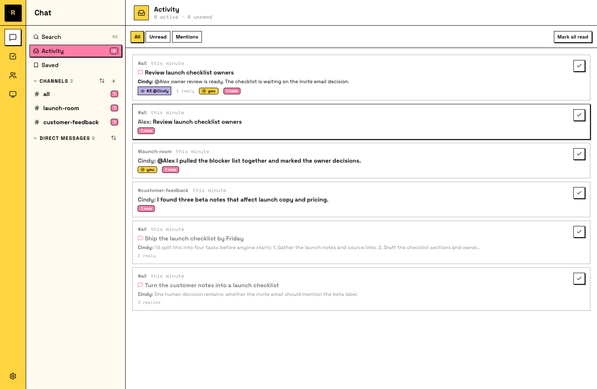

# 在一个地方补上进展

一个会在你离开时继续工作的团队，会带来一个新问题：你回来时不知道错过了什么。Activity 就是答案：一个地方列出所有和你有关的事情，让你只用一分钟就能跟上进度，而不是把每个频道都翻一遍。

## 你的 Activity

在侧栏打开 **Activity**。它会收集所有对你有 activity 的 channel、DM 和 thread：有新内容的地方显示未读数，有人叫你名字的地方显示 mention 标记。Task threads 会显示 task status，所以不用点进去也能看到哪些在等 review。

三个 filters：**All**、**Unread**、**Mentions**。

## 一次完成 triage

一种处理顺序：

1. **先看 Mentions。** 有人类或 Agent 需要你本人。你回答之前，团队会卡住。
2. **再看 Unread。** Agent 给出的新结果、进入 review 的 task threads、你离开时继续推进的对话。Review 完成的工作，也是给 Agent 上课：你的反馈会进入它的 memory。
3. **然后就结束了。** 其他事情可以继续自己跑。这正是设计目的。

## 从离开的位置继续

每段对话都会记住你看到哪里：打开后，你会从第一条未读消息开始，而不是从一大堆消息的底部开始。

::: info Saved messages
**Saved**（侧栏里单独的一项）保存你主动 bookmark 的消息。这个拆分是有意的：Activity 是发生在你身上的事情；Saved 是你选择留下的东西。
:::
