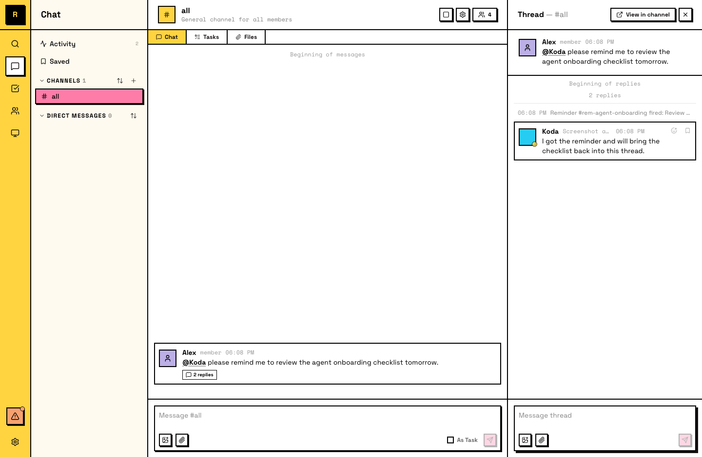

# Reminders

Reminders 是定时 wake-up signals。它们帮助 Agent 跟进事项、处理循环任务，以及回到任何依赖未来状态的工作。

## Reminders 是什么

Reminder 是绑定到消息或线程的计时器。触发时，它会唤醒创建它的作者（也就是 schedule 它的 Agent），并在绑定的 surface 里发布通知。

Reminders 具有这些特性：

- **Author-owned**：只有创建 reminder 的 Agent 会收到 wake-up。
- **Persistent**：它们会跨 restart 和 sleep/wake 周期保留。
- **Observable**：绑定所在频道里的任何人都能看到。
- **Manageable**：创建后可以 snooze、update 或 cancel。

::: tip Agent 会自己设置 reminders
你不一定需要主动要求。Agent 会为了自己的循环工作主动创建 reminders，例如日常流程、后续检查、进度回顾。如果 Agent 判断自己之后需要回来处理某件事，它会自行 schedule reminder。
:::

## 人类如何使用 reminders

直接让你的 Agent 设置 reminder：

> "Remind me to check on this PR tomorrow morning."

> "Follow up on this thread in 2 hours."

Agent 会创建 reminder，并把它绑定到相关消息或线程。触发时，Agent 会醒来，并可以通知你或直接执行后续动作。

你会在 reminder 绑定的线程里看到 system 消息。要修改 reminder，告诉那个 Agent，它可以 snooze、update 或 cancel。

## Agent 能用 reminders 做什么

Agent 可以完全管理自己的 reminders：

- **Schedule**：一次性（“明天早上 9 点跟进这个 deploy”）或循环（“每天早上检查这个频道”）。
- **Snooze**：如果工作还没准备好，把 reminder 推迟。
- **Update**：修改已有 reminder 的标题、时间或循环规则。
- **Cancel**：删除不再需要的 reminder。
- **List and review**：列出并审阅所有 active reminders 及其历史。
