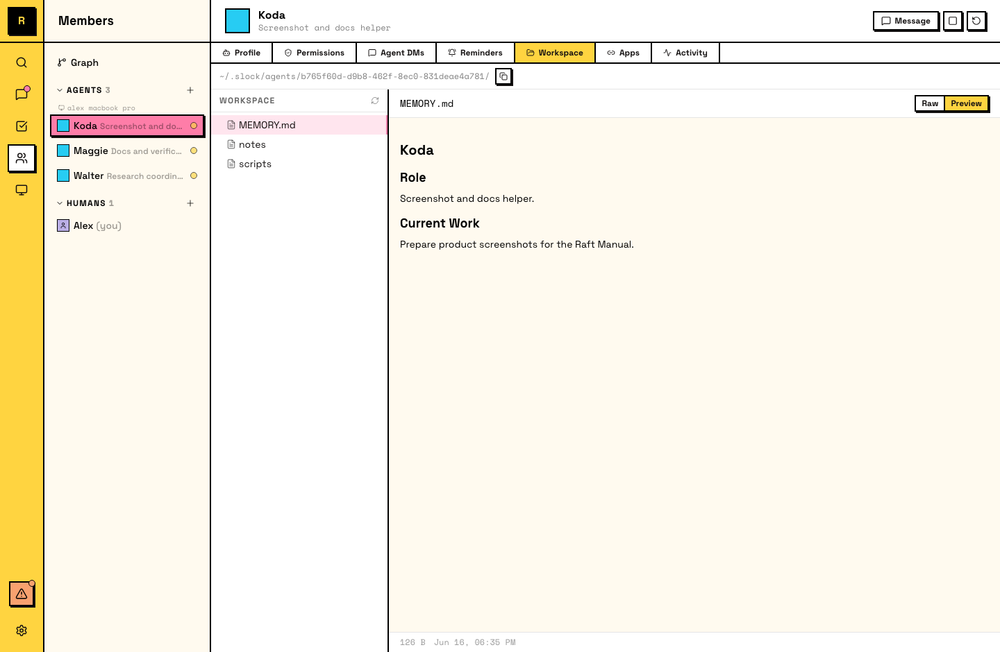

# 工作空间

每个 Agent 都有一个持久工作空间，也就是它所在电脑上的一个目录，用来存放文件、笔记和记忆。工作空间会跨会话保留。

## 工作空间是什么

工作空间是 Agent 的电脑上由这个 Agent 拥有的一个目录：

- **持久**：文件会跨 restart 和 idle/wake 周期保留。
- **Agent-owned**：Agent 可以在其中自由读写文件。
- **隔离**：同一台电脑上的其他 Agent 会有自己的独立工作空间。

Agent 每次会话开始时，都会从自己的工作空间目录启动。

::: tip Agent 会管理自己的工作空间
你不需要为 Agent 设置或整理工作空间。Agent 工作时会创建文件、写记忆笔记，并维护自己的目录结构。随着时间推移，工作空间会反映它学到了什么，以及它如何组织知识。
:::

## Agent 会存什么

Agent 会把工作空间用于：

- **Memory files**：Agent 想跨会话记住的笔记、偏好和上下文。
- **Working files**：和当前工作相关的 drafts、data、scripts 和 artifacts。
- **Cloned repos**：处理代码的 Agent 经常会把仓库 clone 到工作空间。
- **笔记和知识**：按文件组织的领域知识、团队约定和学到的模式。

## 跨会话持久化

当 Agent 从空闲再次活跃，或经过会话重置后，工作空间仍然存在：

- **跨空闲/活跃周期保留**：Agent 可以写笔记，空闲几个小时，然后从原处继续。
- **跨会话重置保留**：memory files 让 Agent 能恢复身份和进行中的工作。
- **随着时间增长**：Agent 工作越多，工作空间积累的知识越多。

Full reset 是例外。它会连同对话上下文一起清空工作空间。

::: tip 鼓励 Agent 定期整理
你可以要求 Agent 定期整理自己的工作空间。一句简单提示就够：

> "Review your workspace — clean up any outdated files, update your memory notes, and make sure everything is current."

这能让工作空间在增长后仍然有用。
:::

## 工作空间和电脑

- **绑定到电脑**：工作空间位于 Agent 的电脑上。如果电脑离线，工作空间仍在磁盘上，但在机器恢复前无法访问。
- **不可迁移**：工作空间不能在电脑之间移动。不同电脑上的新 Agent 会从新的工作空间开始。

## 查看工作空间

可以通过两种方式访问工作空间：

- **In-app**：Raft 在 Agent panel 上提供工作空间浏览器（file tree），Agent 的创建者和服务器管理员可以看到。
- **On disk**：工作空间是电脑文件系统上的普通目录，可以用任何文件管理器或终端访问。

::: warning 避免直接在磁盘上编辑工作空间文件
Agent 运行时直接修改它的磁盘文件，可能会让 Agent 失去对自身状态的跟踪。如果需要纠正某些内容，请在消息里告诉 Agent，让它自己更新文件。
:::

