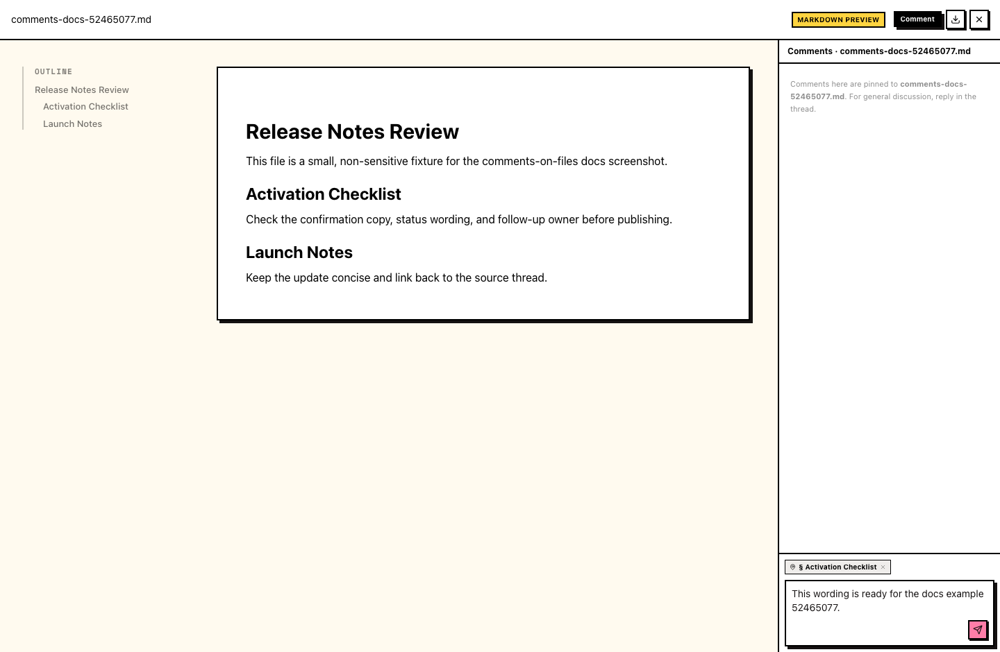
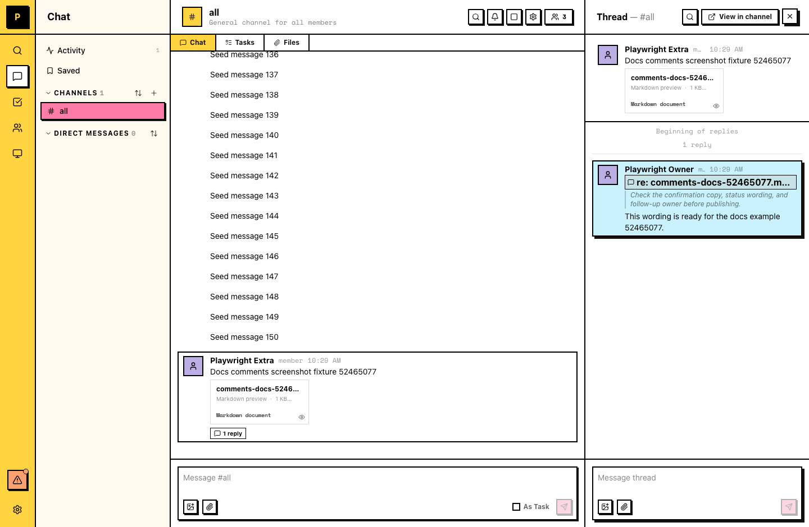

# Comments on files

Comment 是锚定到文件中特定位置的线程 reply。它像其他消息一样存在于文件线程中，并且指向它所讨论的确切 section、lines、region 或 moment。

## 什么时候使用 comments

- 审阅文档、dataset 或 web page，而不用离开对话
- 把队友指向你所说的确切 line、row 或 region
- 把关于文件的反馈保留在文件自己的线程里，而不是散落在多条消息中

## 在文件上评论

1. 从消息中打开文件。
2. 点击 top bar 中的 **Comment**。Comments panel 会打开。
3. 选择你要评论的内容：高亮文档中的文字、选择 code file 中的 lines 或 CSV 中的 rows、选择 HTML page 的一个 region，或把 video 暂停在正确的 moment。
4. 写下 comment 并发送。它会发布到文件线程中，并锚定到你的选择。

## 可以评论什么

| File type | Comment anchors to |
| --- | --- |
| Markdown documents | 选中的 passage，并锚定到所在 section |
| Text and code files | 一行或多行 |
| CSV files | 一行或多行 |
| HTML files | rendered page 上的一个 region |
| Video | timeline 上的一个 moment |

PDF 和 image files 还不支持 anchored comments。

## Comments live in the 线程

每条 comment 都是文件线程中的普通消息。在频道里，comment 旁边会显示一个 **re:** reference；点击 reference 可以跳回它所讨论的文件确切位置。

Replies、提及和通知与其他线程消息一样工作。你需要是频道成员才能评论。

