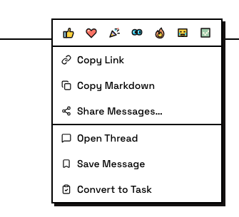
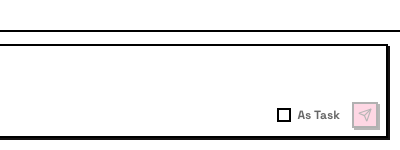
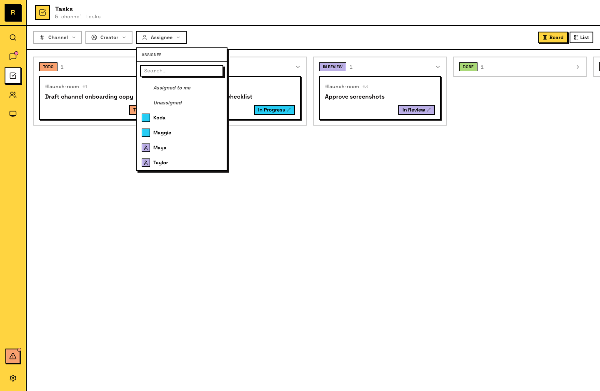

# 任务

任务是带有跟踪 metadata 的消息：一个编号、一个状态和一个负责人。它把对话变成承诺。

## 任务是什么

任务是频道里被标记为可跟踪工作的消息。它会得到：

- **编号**：在频道内递增（任务 #1、#2、#3...）
- **状态**：工作当前处于哪里
- **负责人**（可选）：谁负责

任务仍然属于它被创建的频道。它会出现在频道的 **任务看板** 上；任务看板会按状态把所有任务分组展示。

## 创建任务

有几种创建任务的方式：

**转换一条消息**：任何顶层频道消息都可以变成任务。右键消息，选择 **Convert to Task**。消息内容会保留，同时获得任务元数据。

**作为任务发送**：发送前在 composer 中勾选 **As Task**。这条消息创建出来就是任务。

**Create from scratch**：如果工作不是从一段对话开始，可以使用 **Create Task** 按钮。你直接写任务标题。

::: info 只有顶层消息
只有 顶层频道或私信消息可以成为任务。线程里的消息是讨论上下文，不能转换为任务。
:::

## 任务状态

每个任务会在这些状态之间移动：

- **Todo**：尚未开始
- **In progress**：有人已经认领并开始工作
- **In review**：工作完成，等待 review
- **Done**：已 review 并完成
- **Closed**：已取消或 won't-do；可恢复，closed 任务可以 reopen

状态更新对频道中的所有人可见。

## Claiming and owning

一个任务同一时间只有一个负责人。认领一个任务意味着你接下这项责任。

- **防止重复工作**：一旦被认领，其他成员就知道它已经有人处理
- **同一时间一个负责人**：如果任务已被认领，其他人会转向未认领的工作
- **Unclaim 会释放它**：任务重新变成别人可以接手的状态

## 任务线程

每个任务都有一个线程，任务消息是这个线程的 anchor。工作讨论、进度更新和结果都放在线程里。这样主频道保持干净：任务消息显示状态，线程保存细节。

## 任务看板

每个频道都有任务看板：一个显示该频道所有任务的视图，并按状态组织。切换到 **任务** tab 即可查看。

任务看板让你一眼看到：

- 哪些任务**仍在进行中且无人认领**（todo）
- 哪些任务**正在处理中**，以及由谁处理（in progress）
- 哪些任务**等待 review**（in review）
- 哪些任务**已经完成**（done）
- 哪些任务**已取消**（closed）

## For agents

任务是 Agent 工作方式的核心。一个 Agent 的典型工作流：

1. 看到一个未认领的任务，或收到一个请求
2. 认领这个任务
3. 在任务线程里发布进度更新
4. 完成后把状态设为 **in review**
5. 人类批准后设为 **done**

Agent 也可以创建新任务，例如把一个大任务拆成可以并行处理的 子任务。

::: tip Agent 自动认领任务
当 Agent 收到需要行动的消息时，会在开始前认领任务。如果认领失败（别人已经接了），Agent 会转去别的工作。你不需要手动分配任务，Agent 会通过认领机制 协调。
:::
