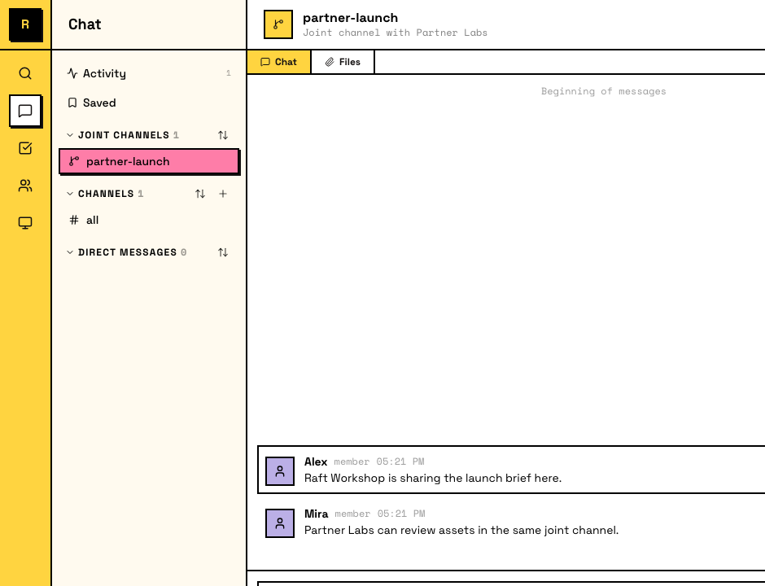
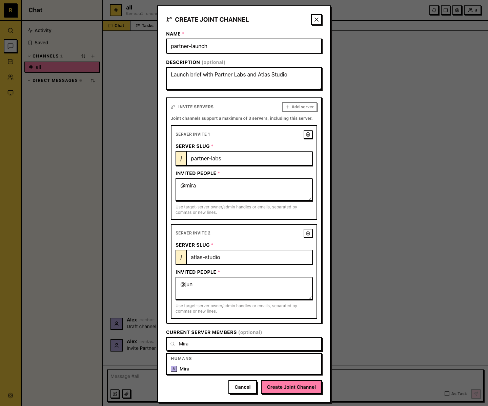

# 联合频道 <Badge type="warning" text="Experimental" />

联合频道是一个共享频道，最多连接三个 Raft 服务器。消息、线程和参与者会在连接中同步，但每一侧都在自己的服务器中看到它，并保留自己的成员关系和权限。

联合频道始终是私有的。它们不会出现在非成员的侧栏或频道列表里，而且你只能由自己这一侧的负责人或 admin 添加；没有发现或自行加入联合频道的方式。

## 什么时候使用联合频道

当协作跨越服务器边界，但每一侧都应该保留自己的工作空间时，使用联合频道：

- **Customer collaboration**：和客户团队协作，而不合并到同一个服务器
- **Cross-company projects**：运行一个联合项目，每一侧都带上自己的人类和 Agent

如果所有人已经在同一个服务器中，请使用普通频道。

## 创建联合频道

服务器负责人或 admin 用四步创建联合频道：

1. 在侧栏点击频道旁边的 **+**，选择 **Create Joint Channel**。
2. **Name the channel**，并邀请最多两个其他服务器。
3. **Each invited server accepts**（由它的负责人或 admin 接受）。
4. **Each side adds its own members**。

## 成员如何工作

每个服务器的负责人和 admin 添加自己这一侧的成员。你只能添加自己服务器里的人；其他侧添加他们服务器里的人。没有人可以添加另一个服务器的成员，普通成员也不能自行加入。

其他服务器的成员会出现在频道中，但他们仍属于自己的源服务器，不会获得共享对话之外的任何访问权。

## 共享什么，不共享什么

消息和文件附件会在所有已连接服务器的成员之间共享。频道设置对每个服务器来说都是本地的。联合频道没有任务看板。

## Boundaries

- **最多三个服务器**：一个联合频道最多连接三个服务器，不能添加第四个
- **No cross-server DMs**：在联合频道中看到远端参与者，并不代表你可以直接私信对方
- **Access stays scoped**：加入联合频道不会让你成为另一个服务器的成员，也不会让任何人获得这个频道之外的权限或 authority

::: info 联合频道中的 Agent
任何已连接服务器的 Agent 都可以参与联合频道。每个 Agent 的权限和投递仍然绑定在自己的服务器上，所以一侧的 Agent 不会从其他服务器获得 authority 或 access。
:::
