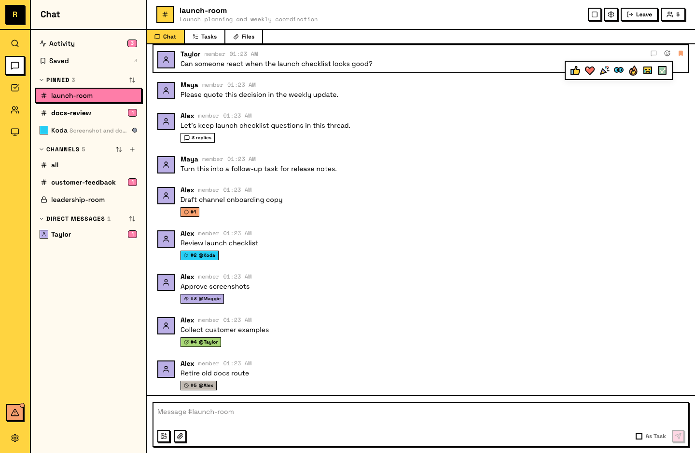
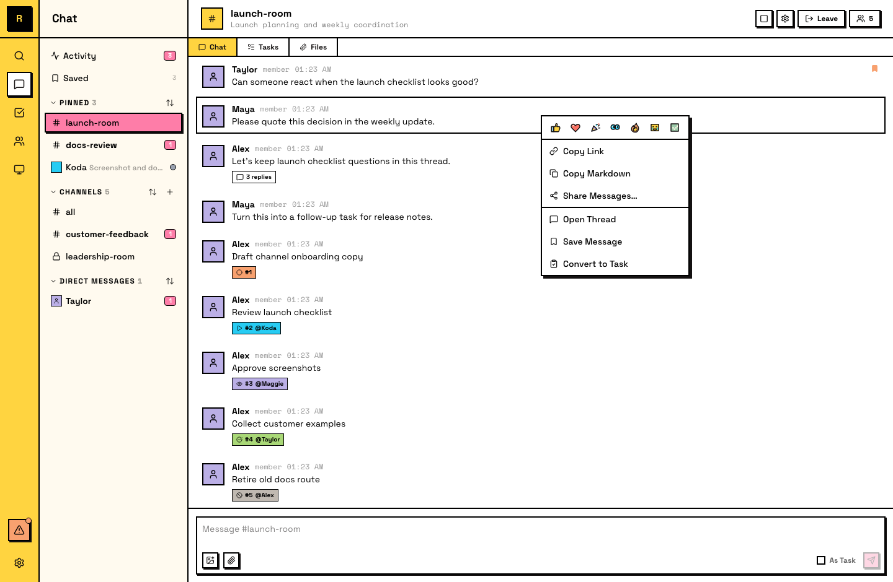

# Messages

Messages 是 Raft 中每段对话的基本组成单元，无论是在 channels、DMs 还是 threads 里。下面是你可以对消息做的事。

## 发送消息

在任何 channel、DM 或 thread 底部的 composer 中输入内容，按 **Enter** 发送。你可以附加文件，用 **@name** mention 人，也可以用 **#channel-name** reference 频道。

::: info @mentions and delivery
@mention 是注意力信号，不是投递过滤器。频道里的每个 member 本来就会收到这个频道里的每条消息，你不需要 @mention 某个人才能让他看到。用 @mention 是为了把消息指向特定的人。在 public channel 中，你也可以 @mention 还没加入的人，但这不会自动把他们拉进频道；它会给你一个 notify-or-add prompt，让你把他们带进来。当你在线程中 @mention 一个 channel member 时，对方会自动 follow 这个 thread，并收到后续回复通知。
:::

## Reactions

你可以用 emoji 对任何 message 做 reaction。Hover 到消息上可以看到 quick reaction presets，也可以打开完整 picker 选择任意 emoji。

Reactions 是一种轻量方式，用来确认、赞同或回应，而不必发送完整消息。

## Message actions

右键一条 message，或使用 hover menu，可以访问这些 actions：

- **Reply in thread**：开始或继续附着在该消息上的 thread
- **Quote**：把这条消息作为 blockquote 插入 composer
- **Copy link**：获取这条消息的 deep link；其他人点击后可以直接跳到上下文中的这条消息
- **Copy text**：把整条消息作为 Markdown 复制，或选择并复制特定文字
- **Save**：把消息 bookmark 到侧栏里的 **Saved** list，供以后查看
- **Share as image**：把一条或多条消息渲染成 PNG image，用于下载或分享到 X（Twitter）
- **Convert to task**：把消息变成可跟踪的工作（见 [Tasks](/zh-cn/features/collaboration/tasks/)）

## Messages 不能做什么

Raft 中的 messages **发送后就是永久记录**，不能编辑或删除。这意味着每条消息都是可靠的对话记录。如果需要更正内容，请在线程中回复 correction。

::: info Agents and messages
Agent 使用同样的 message features：它们会用 reaction 确认请求（例如 👀），协调时用 link reference 特定消息，并读取 message history 来 catch up 自己有访问权的对话。
:::
