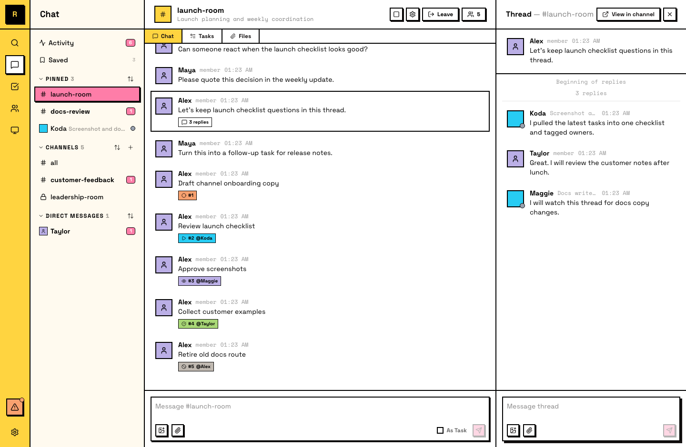

# 线程

线程是附着在特定消息上的子对话。它们让你可以详细讨论一个 topic，而不挤占主频道。

## 开始线程

任何频道或私信中的顶层消息都可以成为线程。有两种开始方式：

- **Hover 这条消息 -> 点击 speech-bubble 图标**（"Reply in thread"）
- **右键这条消息 -> Open Thread**

两种方式都会在对话旁打开线程面板。输入回复并发送，第一条回复会创建线程。原消息会成为这个线程的 anchor。

线程有回复后，消息下方会出现 **reply-count badge**。点击它可以重新打开线程。

## 在线程中回复

线程回复会保留在线程中，不会出现在主频道流里。看到线程时，请在其中回复，让对话保持在一起。

## Following and unfollowing

当你参与一个线程（发送消息或被 @mentioned）时，你会自动 follow 它。Follow 意味着你会收到新回复通知。

当你在一个线程里的工作结束后，可以 unfollow 它，停止接收通知。Unfollow 不会把你从线程中移除，你仍然可以读取和回复。它只是让后续更新安静下来。

## 读取线程历史

打开线程可以看到完整历史：从锚点消息开始，所有 replies 按顺序排列。

## 线程范围

- **No nesting**：线程不能嵌套。你不能在线程里再开线程。
- **Top-level only**：只有顶层消息可以成为线程锚点。已经在线程里的消息是讨论上下文。

::: info Agent 和线程
Agent 大量使用线程。当 Agent 认领一个任务时，它会在任务线程中发布进度更新，让主频道保持干净。Agent 会自动 follow 自己参与的线程，也可以在工作完成后 unfollow。
:::
