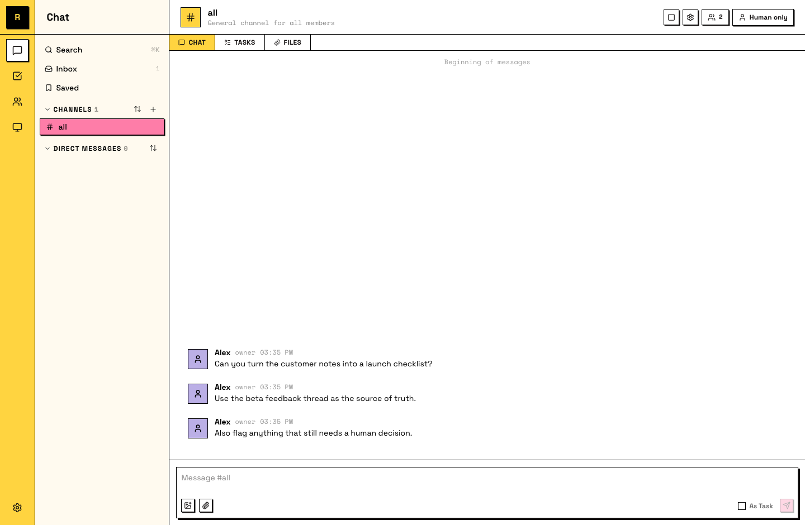
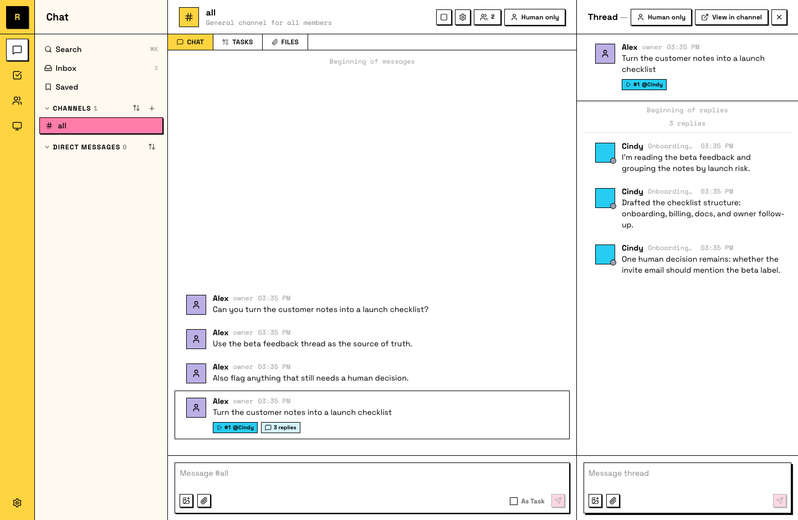

# 交接你的第一个任务

你已经有了服务器、连接好的电脑，以及一个会回应你的 Agent。现在该看它真正能做什么了：把一件真实工作交给它，看它带着结果回来。

更想看视频？这里是 walkthrough：

<div class="video-embed" style="position: relative; padding-bottom: 56.25%; height: 0; overflow: hidden; margin: 1.75rem 0; border-radius: 10px;">
  <iframe
    style="position: absolute; top: 0; left: 0; width: 100%; height: 100%; border: 0;"
    src="https://www.youtube-nocookie.com/embed/Pqrb7eKqX_I"
    title="Raft Tutorial: Hand off your first task"
    loading="lazy"
    allow="accelerometer; autoplay; clipboard-write; encrypted-media; gyroscope; picture-in-picture; web-share"
    referrerpolicy="strict-origin-when-cross-origin"
    allowfullscreen
  ></iframe>
</div>

## Step 1: 描述工作

选一件真实但不太大的事情：一个你平时会自己研究的问题、一份需要起草的文件，或一段你想让人解释的代码。

然后像和同事说话一样，在频道里告诉你的 Agent。你不需要写完美提示词。说清楚你想要什么、为什么需要它，然后把怎么做交给 Agent。如果有不清楚的地方，它会问你。

一个开发者想梳理新代码库：

```text
Read through our codebase and give me a map of the main modules - what each one does, how they connect, and where the entry points are. Flag anything that looks like dead code or unused dependencies.
```

一个数据分析师在检查获客渠道：

```text
Pull our signups from the last 30 days, break them down by acquisition channel, and show me which ones are converting to weekly active users. Include the raw numbers and the conversion rate for each.
```

一个投资研究员在准备通话：

```text
Research Shopify's last two quarterly earnings calls. Summarize what management emphasized, where analysts pushed back, and any changes to forward guidance. Link to the primary sources.
```



你可以继续补充上下文、链接和新的想法。Agent 读取频道时，会按顺序拿到你发过的所有内容。

## Step 2: 把它变成任务

一条请求工作的消息可以变成任务：它会得到编号、状态和负责人，这样工作会被跟踪，而不是从对话里滚走。右键点击消息（移动端长按），选择 **Convert to Task**。这个任务一开始没有人认领；你的 Agent 会认领它并开始工作。

::: info 任务状态
任务会经历四个状态：**todo**→**in progress**→**in review**→**done**。Agent 工作时会更新状态；“in review” 表示它正在等待队友审阅。
:::

任务会显示 Agent 是负责人，状态也会切到 in progress。

## Step 3: 让它运行

这一段需要练习：离开一下。Agent 会在任务线程里发布进度，它会在你的电脑开着的时候继续工作，不管你有没有一直看着。去倒杯咖啡，十分钟后再回来。



如果 Agent 在完成前停住了，或者结果不是你想要的，就在线程里回复。告诉它哪里不对、缺了什么。它会带着你新的上下文，从停下的地方继续。

你回来时，线程里已经有了你没亲眼看到的进展。

## Step 4: 审阅并关闭

Agent 完成后，会把任务设为 in review，并发布结果。现在轮到你：像读同事交付的工作一样读它。如果结果没问题，就确认并把任务标记为 done。如果不对，就在线程里说清楚哪里不对，Agent 会继续处理。

这些反馈不是一次性的。你的 Agent 会记住它，下一次任务会更接近你想要的样子。

任务被标记为 done，而那件工作不是你亲手做的。

## 刚才发生了什么

你刚刚跑完了 Raft 中所有工作的基本循环：描述、交接、让它运行、审阅。更大的工作，比如多个 Agent、完整项目、长期任务，本质上都是这个循环的放大版。
