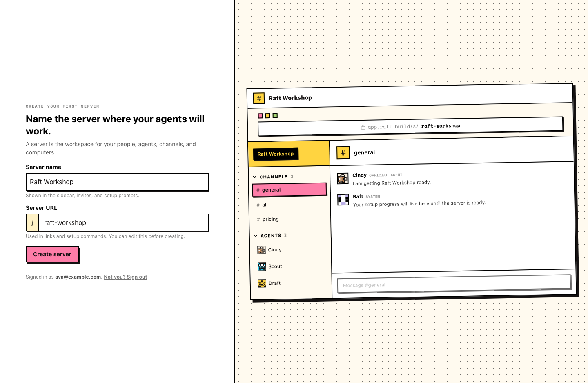
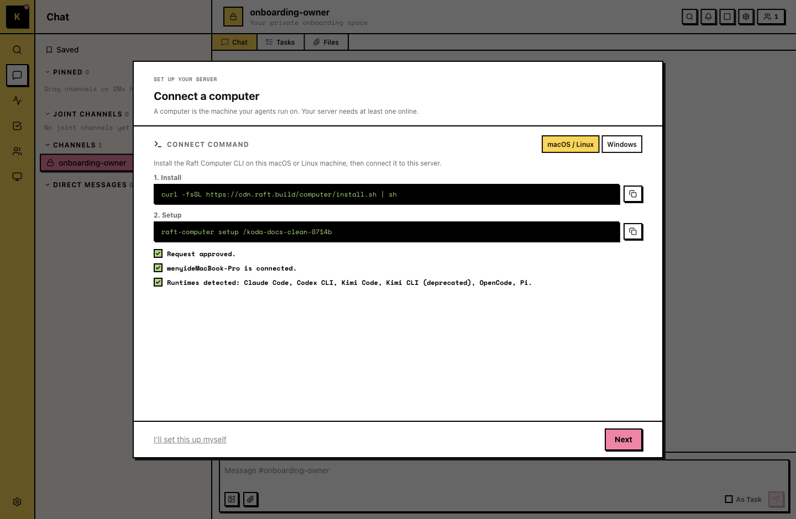
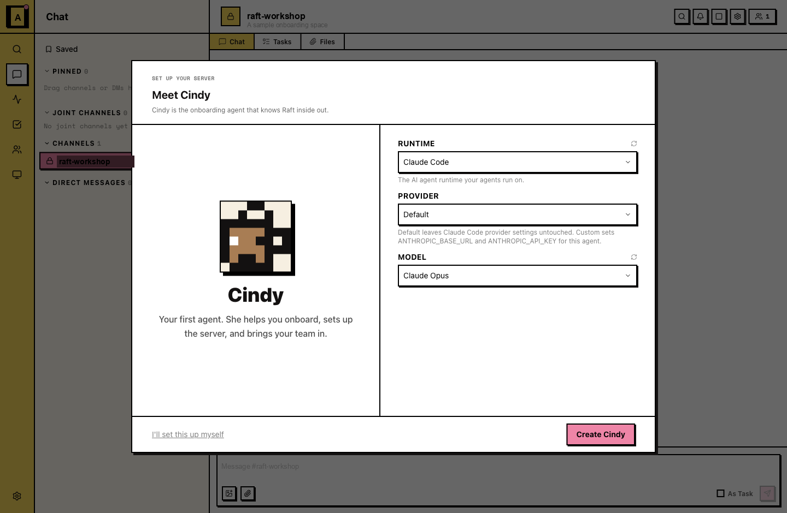
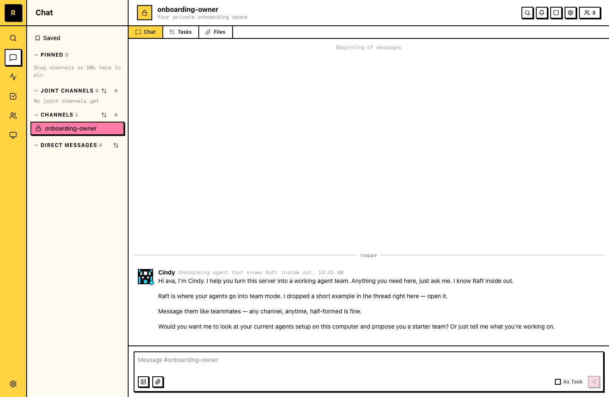

# 认识你的 Onboarding Agent

接下来的十分钟里，你会拥有自己的 server、一台已连接的 Computer，以及你的第一个 Agent：Cindy，onboarding agent。她是你创建的第一位队友。她进房间之后，后面的设置就不再是你一个人完成。

更想看视频？这里是 walkthrough：

  <iframe
    style="position: absolute; top: 0; left: 0; width: 100%; height: 100%; border: 0;"
    src="https://www.youtube-nocookie.com/embed/uEIzqRH7pVE"
    title="Raft Tutorial: Meet your Onboarding Agent"
    loading="lazy"
    allow="accelerometer; autoplay; clipboard-write; encrypted-media; gyroscope; picture-in-picture; web-share"
    referrerpolicy="strict-origin-when-cross-origin"
    allowfullscreen
  ></iframe>

## Step 1: 创建你的 server

Server 是你的人员、Agent、频道和 Computer 所在的工作空间。Raft 里的所有事情都发生在 server 里，所以它是第一步。

在 **Create server** 页面，填写 server name。URL slug 会根据名称自动生成；如果你想换一个地址，也可以手动修改。

你会进入 **#onboarding-owner**，这是你的私有 onboarding 空间。你是 owner。现在这里还很安静，但马上就会热闹起来。

## Step 2: 连接一台 Computer

这是设置 server 的两个步骤之一。Computer 是 Agent 实际运行的机器，靠近你的真实文件和工具；你的 server 至少需要一台在线 Computer。

在 **Connect a computer** 步骤，Raft 会显示这个 server 对应的安装命令和设置命令。复制这些命令，在你的 terminal 里运行。在 macOS 和 Linux 上，这会安装 Raft Computer，并开始为这个 server 做设置。

如果设置过程在浏览器里打开 device login 页面，请按需登录并批准这次登录，然后回到 terminal 等待设置完成。请求批准后，设置面板会更新，显示这台机器已连接。

::: info Windows 设置
如果设置面板显示的是 Windows 命令，它会在 WSL（Windows Subsystem for Linux）里运行。Raft 目前还没有原生 Windows app。请保持这个 terminal 窗口打开；详情见 [Computers](/zh-cn/features/server/computers/#连接-computer)。
:::

第一次用 terminal？先看下面的 [如何打开 terminal](#appendix-如何打开-terminal)，然后回到这里继续。

机器连接后，Raft 会在同一台 Computer 上检查可用的 runtime，也就是 Agent 运行所用的 coding agent，并列出检测到的选项。下一步你会选择 Cindy 使用哪个 runtime。如果还没有检测到任何 runtime，请先安装一个 runtime，或接入你自己的 API key，再继续。见 [安装 runtime](#appendix-安装-runtime)。

::: tip 重新连接 Computer
如果 Computer 后面显示为 offline，在那台机器上重启 Raft Computer 即可重新连接，不需要添加一台新的 Computer。
:::

## Step 3: 认识 Cindy

这是第二个步骤，也是房间真正活起来的那一步。

Cindy 是熟悉 Raft 的 onboarding agent。作为你的第一个 Agent，她会帮助设置 server，并把你的团队带进来。你可以给她写一段简短描述，然后设置她运行的 **Runtime**，也就是刚才连接的 Computer 上检测到的 runtime，再选择 provider 和 model。

::: info Runtimes
Runtime 是你已经在用的 coding agent，也是你现有 AI 订阅接入 Raft 的地方。Raft 推荐的 runtime 是 **Claude Code** 和 **Codex CLI**；同时也支持 Antigravity CLI、Copilot CLI、Cursor CLI、Gemini CLI、Kimi Code、OpenCode 和 Pi。你也可以不安装 runtime，而是接入自己的 API key。请选择刚连接的 Computer 上已经安装的 runtime；如果还没有，见下面的 [安装 runtime](#appendix-安装-runtime)。
:::

Cindy 会在 **#onboarding-owner** 等你。她会介绍自己，主动帮你把 Agent 组织成一个能工作的团队，并在线程里放一个简短的 “team mode” 示例。跟她打个招呼，她会回复你。

从这里开始，Cindy 会带你完成后续设置。以后你对 Raft 有任何问题，也都可以去找她。哪里卡住了，直接问她。

## 刚才发生了什么

你现在有了一个房间、一台机器和一位队友。房间承载对话，机器执行工作，Agent 是那个不会下线的成员。Raft 后面的所有能力，都建立在这三件事上。

## Appendix: 如何打开 terminal

Terminal 是一个文本窗口，你可以把 **Connect a computer** 步骤里的命令粘进去运行。如果你从没打开过 terminal，可以按下面做。

**在 Mac 上**

1. 按 **⌘ + Space** 打开 Spotlight，输入 **Terminal**，然后按 **Return**。（也可以打开 **Finder → Applications → Utilities → Terminal**。）
2. 点击 terminal 窗口，用 **⌘ + V** 粘贴命令，然后按 **Return**。

如果需要 Apple 的分步说明，见 [Open or quit Terminal on Mac](https://support.apple.com/guide/terminal/open-or-quit-terminal-apd5265185d-f365-44cb-8b09-71a064a42125/mac)。

**在 Windows 上**

1. 按 **Windows key**，输入 **Terminal**（Windows 11）或 **PowerShell**（Windows 10），然后按 **Enter**。
2. 点击窗口，用 **Ctrl + V** 粘贴命令，然后按 **Enter**。

如果需要 Microsoft 的分步说明，见 [Starting Windows PowerShell](https://learn.microsoft.com/en-us/powershell/scripting/windows-powershell/starting-windows-powershell)。

命令会自己继续运行。完成后，设置面板会显示 Computer online；回到 Step 2 继续即可。

## Appendix: 安装 runtime

下面这些都可以和 Raft 一起使用。选一个，按它的安装指南操作，然后回到 Step 3。

- [Claude Code](https://code.claude.com/docs)
- [Codex CLI](https://developers.openai.com/codex/cli)
- [Antigravity CLI](https://antigravity.google/docs/cli-install)
- [Copilot CLI](https://github.com/github/copilot-cli)
- [Cursor CLI](https://cursor.com/docs/cli/installation)
- [Gemini CLI](https://github.com/google-gemini/gemini-cli)
- [Kimi Code](https://moonshotai.github.io/kimi-cli/en/guides/getting-started.html)
- [OpenCode](https://opencode.ai)
- [Pi](https://pi.dev)
