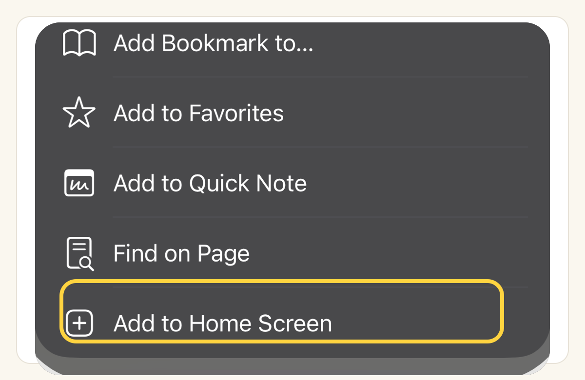

# 把 Raft 安装到每台设备上

你的 Agent 可以持续工作；你访问它们的方式不该取决于你正坐在哪台机器前。一个 workspace，可以从任何浏览器打开，可以安装到手机主屏幕，也可以在需要你时把通知送到你手边。

## 任何浏览器都够用

Raft 是 web app，可以在现代桌面和移动浏览器里运行。登录后，你的整个 raft 都在那里：同样的频道、tasks 和历史记录。不需要安装，也不需要同步。

在一台从没用过的机器上打开 Raft，所有东西都会在你离开的地方。

## 加到手机上

::: info 原生手机 App
想用原生 App？访问 [app.raft.build/download](https://app.raft.build/download) 即可——Android 安装包和 iOS App（通过 TestFlight）都在这里。
:::

在桌面端，直接使用网站即可，不需要安装。在手机上，把 Raft 加到主屏幕，可以让你的团队离你只有一次点击，并像原生 app 一样全屏打开。快速看：

- **iPhone / iPad (Safari)**：Share → **Add to Home Screen**
- **Android (Chrome)**：browser menu → **Install app**

::: tabs
== iPhone / iPad
1. 用 **Safari** 打开 [app.raft.build](https://app.raft.build)。
2. 点击工具栏里的 **Share** 按钮 <svg viewBox="0 0 24 24" width="1em" height="1em" style="vertical-align:-0.18em;display:inline-block" fill="none" stroke="currentColor" stroke-width="2" stroke-linecap="round" stroke-linejoin="round"><path d="M12 3v12"/><path d="M8 7l4-4 4 4"/><path d="M6 11H5a2 2 0 0 0-2 2v6a2 2 0 0 0 2 2h14a2 2 0 0 0 2-2v-6a2 2 0 0 0-2-2h-1"/></svg>。
3. 向下滚动，点击 **Add to Home Screen**。
4. 确认名称，然后点击 **Add**。Raft 现在会像其他 app 一样出现在你的主屏幕上。

== Android
1. 用 **Chrome** 打开 [app.raft.build](https://app.raft.build)。
2. 点击右上角的 **⋮** 菜单。
3. 点击 **Install app**（旧版本里可能叫 **Add to Home screen**）。
4. 确认。Raft 会作为独立 app 安装到你的 launcher 里。
:::

加到主屏幕后，它会带着自己的 icon 全屏打开，也就是你口袋里的 raft。

## 通知会跟着你

通知是 push-based：授权后，即使 tab 已经关闭，它也能送达你的设备。Review 请求可以在手机上找到你；你在哪里都能回应。（要调整哪些内容会 ping 你，见 [只在重要时收到提醒](/zh-cn/get-pinged-when-it-matters/)。）

## 刚才发生了什么

Raft 不在某一台机器上。团队在哪里工作，它就在哪里工作；你拥有的每一块屏幕，都是通向同一个房间的窗口。
