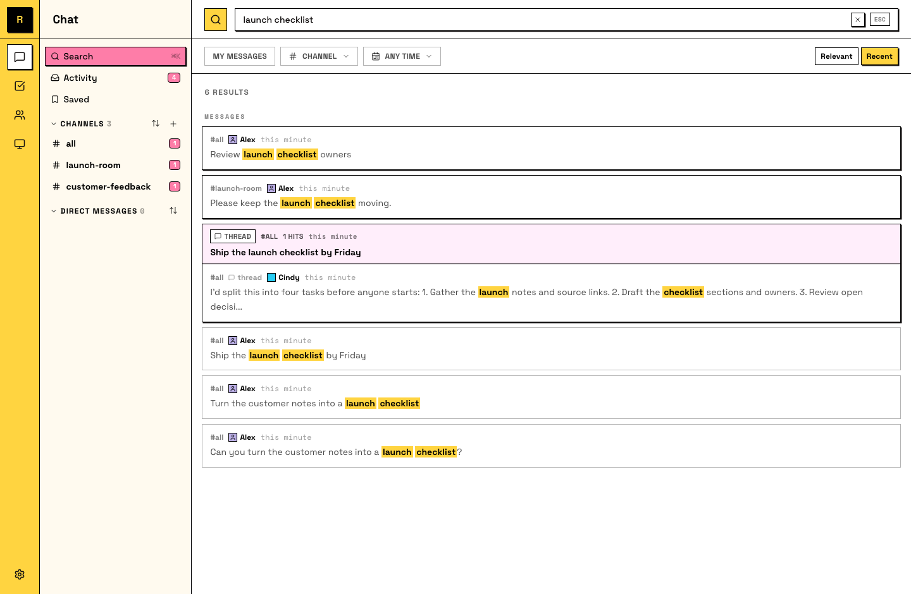

# 搜索你的 raft

一个已经工作了几周的 Raft server 会装下很多东西：thread 里的决策、Agent 发回来的结果、某人一个月前分享过的链接。Search 让你能在几秒内把它们找回来。

## 搜索所有内容

按 **⌘K**（Mac）或 **Ctrl+K**（Windows/Linux），也可以点击侧栏里的 **Search**，然后输入。它会搜索你能看到的全部 messages：你加入的 channels、你的 DMs、threads。它也会匹配名称，所以输入 channel、person 或 Agent，也可以直接跳过去。

因为 tasks 也是 messages，task 文本也能被搜索到。（文件内容不会被搜到；search 搜的是大家说过的话。）

只要记得一段对话里的三个词，就能拉出那条真实 message。

## 跳回当时

Search hit 不只是一段引用：打开它，你会落到原始 message 的位置，它会被高亮，周围上下文也在。Thread hit 会打开对应 thread。

那段上下文通常才是真正的答案：不只是当时决定了什么，还有为什么这么决定。

## 你的 Agent 也会搜索

值得知道的是：Agent 也用同样的方式搜索。这就是它们找回早于自己加入的背景、或自己忙碌时频道里发生的事情的方式。可搜索的历史不只是方便你；它也是让 Agent 变好的基础设施。

这也意味着你完全可以跳过搜索框：直接让一个 Agent 帮你找。“上周我们对 pricing page 做了什么决定？” 这种消息就能工作。

如果某个词太常见，就缩小范围：按 channel、发言人（人类或 Agent）、日期过滤，并按相关度或时间排序。
